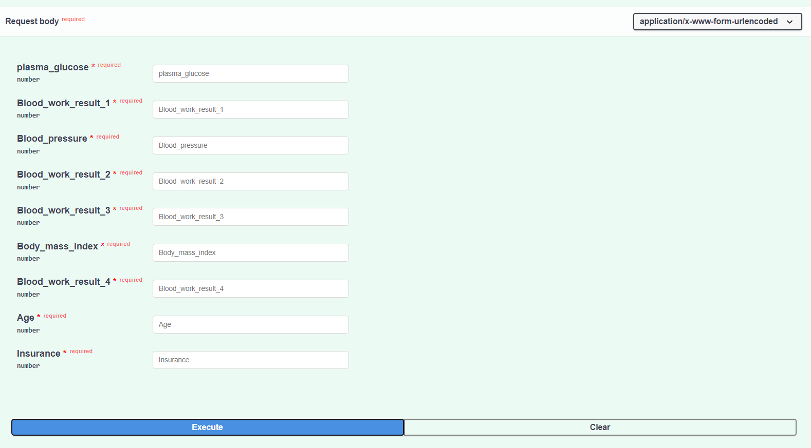
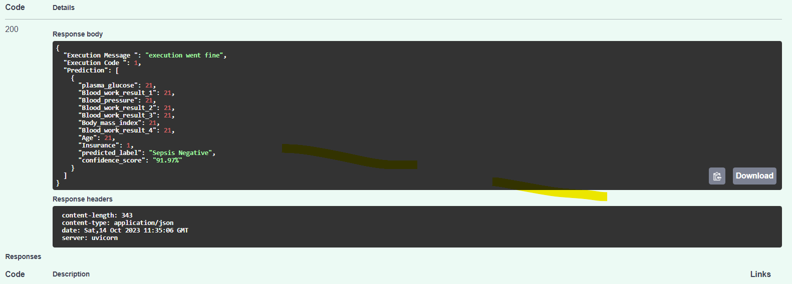
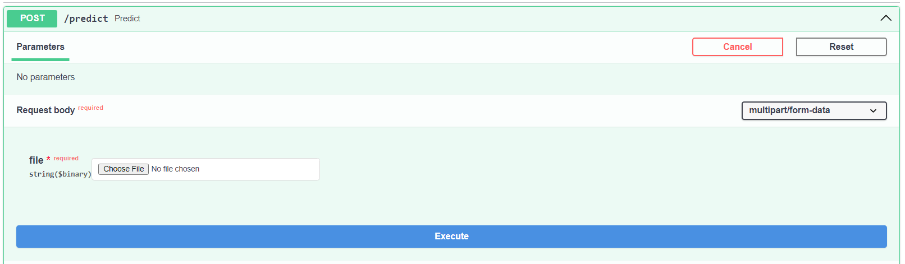
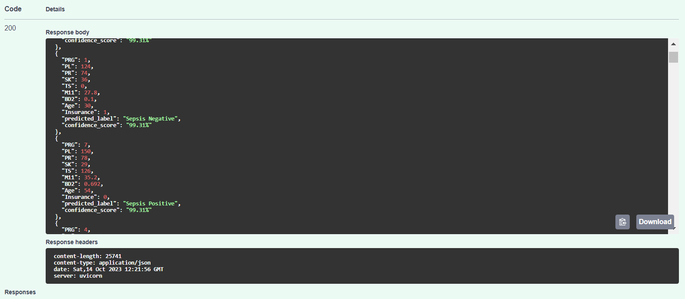

<h3 align="center">
Hi there, I'm <b>Henok</b> 👋 
</h3>  

<h2 align="center">
I'm a Data Analyst and Python Programmer !
</h2> 

# Technical Skills 

# Machine Learning API using FastAPI 

## Introduction

## Setup

For manual installation, you need to have [`Python3`](https://www.python.org/) on your system. Then you can clone this repo and follow the steps below:

- Windows:
        
        python -m venv venv; venv\Scripts\activate;
        python -m pip install -q --upgrade pip;
        python -m pip install -qr requirements.txt
  
- Linux & MacOs:
        
        python3 -m venv venv; source venv/bin/activate;
        python -m pip install -q --upgrade pip;
        python -m pip install -qr requirements.txt
The both long command-lines have a same structure, they pipe multiple commands using the symbol **;** but you may manually execute them one after another.

1. **Create the Python's virtual environment** that isolates the required libraries of the project to avoid conflicts;
2. **Activate the Python's virtual environment** so that the Python kernel & libraries will be those of the isolated environment;
3. **Upgrade Pip, the installed libraries/packages manager** to have the up-to-date version that will work correctly;
4. **Install the required libraries/packages** listed in the `requirements.txt` file so that it will be allow to import them into the python's scripts and notebooks without any issue.

**NB:** For MacOs users, please install `Xcode` if you have an issue.

## How to Run

The project consists two application. The first one accepts inputs from the user and return result with its confidentiality score. The second on accepts csv file which has input of various rows that going to be predicted. So the app read the file and retrieve records and predict for each rows and append the result with confidentiality score.

## 1. App one

- To run the first app adjust

       cd Docker_ML\New folder\Docker_ML\app
  
- The run the  python file
 
      py main.py

- Then browse to

      http://127.0.0.1:8000

## 2. App two

  - To run the second app adjust

       cd Docker_ML\New folder\Docker_ML\app_for_file
  
- The run the  python file
 
      py main.py

- Then browse to

      http://127.0.0.1:8000
        
## Screenshots

<table>
    <tr>
        <th>App</th>
        <th>Result</th>
        <th>App for file</th>
        <th>Result for file</th>
    </tr>
    <tr>
        <td></td>
        <td></td>
        <td></td>
        <td></td>
    </tr>
</table> -->

### 🤝 Connect with me:

##

# Further Link
[MEDIUM](https://medium.com/@heneyr24/time-series-prediction-2c659b39356e?source=friends_link&sk=5c59b70a5e35ee9d5c59a382d9ab1919)
